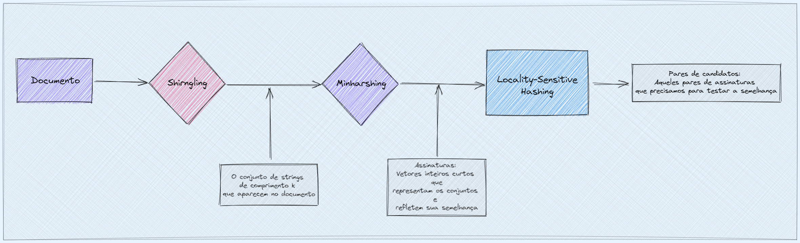

<center> <h1>Funções Hash, Binary Tree e O(n)</h1></center>
<center>Valdeci S. B. S.</center>

<center>11/02/2022</center>
<br>


<center>

Notas: <br>
Para a correta visualização de funções em latex instale a extensão [Xdoc](https://github.com/nschloe/xhub) no chrome. <br>
[Aqui](https://colab.research.google.com/drive/1OuI8QwfGDcx4usCbPrzKoHfpBuZLxvbw?usp=sharing) voce encontra os respectivos códigos em Python.

</center>

___

<center> <h2>Funções Hash</h2></center>

> Muitos algoritmos para analisar tendências de compras, documentos de texto e até mesmo informações genéticas contam com os conceitos de função hash.
> -   Dan Isaza, Stanford Math & CS | VP of Engineering at Clever Real Estate

Uma **função hash** é um [algoritmo](https://www.wikiwand.com/pt/Algoritmo "Algoritmo") que mapeia [dados](https://www.wikiwand.com/pt/Dados_(computa%C3%A7%C3%A3o) "Dados (computação)") de comprimento variável para dados de comprimento fixo. Os valores retornados por uma função hash são chamados **valores hash**, **códigos hash**, **somas hash** (**hash sums**), **checksums** ou simplesmente **hashes**. Um uso é uma estrutura de dados chamada de [tabela hash](https://www.wikiwand.com/pt/Tabela_hash "Tabela hash"), amplamente usada em software de computador para consulta de dados rápida. Funções hash aceleram consultas a tabelas ou bancos de dados por meio da detecção de registros duplicados em um arquivo grande.

-   Eles são rápidos para calcular com busca O(1).
-   Eles são determinísticos, ou seja, não são aleatórios e podem ser repetidos.
-   Mesmo que as entradas sejam semelhantes, como “ABC” e “ACB”, as saídas não devem estar correlacionadas.
-   É praticamente inviável prever a saída de uma função hash ou reverter um valor hash para seu valor original.
-   Eles podem mapear um número infinito de entradas, e de qualquer comprimento, para saídas de comprimento fixo.
-   Portanto, uma função hash gera um número finito de saídas. Funções de hash mais longas com mais saídas possíveis.

Como dito no ultimo ponto, um problema que pode surgir é a colisão entre códigos hash, imagine também que, em vez de fazer hash dos nomes das pessoas, estamos usando URLs de sites, endereços ou até mesmo versões de scripts (o Github usa sha-1 para IDs de commit). O problema ou paradoxo do aniversário diz respeito à "probabilidade de duas pessoas em uma sala fazerem aniversário no mesmo dia?" e para hashes isso se traduz em “a probabilidade de quaisquer dois hashes compartilharem o mesmo valor dados hashes de comprimento n”, abaixo temos o gráfico da probabilidade de colisão, o código pode ser encontrado [aqui]().

<br>
<center> <h4>Aplicações das Funções Hash</h4></center>

Este tipo de função possui aplicações nas áreas de criptografia, data mining e machine learning.


<br>

<center> <h4>Funções Hash Criptográficas</h4></center>

> Notas:
> Funções Hash Criptográficas são mais lentos do que funções Hash genéricas.
>
>A regra prática é muito simples: se você tem restrições de segurança, então você precisa de um hash criptográfico, se não, então você precisa de uma função de hash genérica.
>
>Algo extremamente importante é entender que as funções de hash criptográficas não produzem menos colisões do que uma função de hash genérica, em termos de uniformidade não há absolutamente nenhuma diferença entre um criptohash de 64 bits e um hash genérico de 64 bits.
>Algumas funções hash genéricas úteis comumente usadas são Murmur, Cityhash, FNV, Jenkins, etc.
>
>Uma vez que as funções criptográficas devem atender aos requisitos que as funções hash genéricas não precisam, elas são intrinsecamente mais lentas e não faz sentido usá-las quando você não precisa dos recursos relacionados à segurança.


Existem duas soluções Data masking e a criptografia de dados são duas soluções de privacidade de dados tecnicamente distintas. A criptografia de dados, no nível do campo de dados estruturados, é uma função de mascaramento de dados. No entanto, ambos podem ser úteis para abordar a conformidade regulamentar, como o LGPD, GDPR e CCPA e outros casos de uso de privacidade de dados, como proteção de análise de big data para reduzir os riscos de exposição de dados.

Diferença fundamental: a criptografia é normalmente aplicada a dados em repouso ou links de dados (dados em movimento) onde a usabilidade não é necessária em um aplicativo em tempo real, como armazenamento de dados de longo prazo ou transferências de dados. O gerenciamento de chaves tradicional permite que os dados criptografados sejam transformados de volta em texto não criptografado (legível) para uso em aplicativos quando necessário, mas não é uma solução de privacidade de dados diferenciada - ela opera em arquivos ou volumes de dados, como o que você encontra em arquivos de dados.


<br>

<center> <h4>Locality-Sensitive Hashing</h4></center>

Nos permite evitar calcular a similaridade de cada par de conjuntos ou suas assinaturas min-hash. Se recebermos assinaturas para os conjuntos, podemos dividi-los em bandas e só medir a similaridade de um par de conjuntos se eles forem idênticos em pelo menos uma banda. Ao escolher o tamanho das bandas adequadamente, podemos eliminar da consideração a maioria dos pares que não atendem ao nosso limite de similaridade.

Quando dados grandes conjuntos de dados definidos por informações relacionadas a outras informações, quais são algumas maneiras de armazenar e recuperar informações com eficiência? Para gerenciar grandes quantidades de dados relacionais, precisamos ter estruturas de dados que tenham a capacidade de manipulá-los rapidamente (ou seja, inserir, excluir e pesquisar). Suponha que temos dados de “chave” que correspondem aos dados de “valor”, então, uma maneira de relacionar duas informações é usar um dicionário que é composto de relacionamentos de chave / valor.
tabelas hash, que é, de longe, o método mais rápido das três implementações de dicionário e pode realizar operações de inserção, exclusão e pesquisa de forma mais eficiente do que as outras duas implementações de dicionário.

Exemplo: 

Você recebeu uma grande coleção de documentos. Você deseja encontrar pares “quase duplicados”.

No contexto deste problema, podemos dividir o algoritmo LSH em 3 etapas amplas:

1.  Shingling:
Nesta etapa, convertemos cada documento em um conjunto de caracteres de comprimento k (também conhecido como k-shingles ou k-grams). A ideia principal é representar cada documento em nossa coleção como um conjunto de k-shingles.

2.  Min hashing:<br>
Etapa 1:  Permutação aleatória (π) do índice de linha da matriz shingle do documento.<br>
Etapa 2: A função hash é o índice da primeira linha (na ordem permutada) na qual a coluna C tem valor 1. Faça isso várias vezes (use permutações diferentes) para criar a assinatura de uma coluna.

3.  Locality-sensitive hashing:
Verifique na memória principal se os pares candidatos realmente têm assinaturas semelhantes




<br>

LSH tem muitas aplicações, incluindo:

1. Detecção de quase duplicados: o LSH é comumente usado para desduplicar grandes quantidades de documentos, páginas da Web e outros arquivos.

2. Estudo de associação de todo o genoma: Os biólogos costumam usar o LSH para identificar expressões gênicas semelhantes em bancos de dados de genoma.

3. Pesquisa de imagens em larga escala: o Google usou o LSH junto com o PageRank para construir sua tecnologia de pesquisa de imagens VisualRank.

4. Impressão digital de áudio/vídeo: Em tecnologias multimídia, o LSH é amplamente utilizado como uma técnica de impressão digital de dados A/V.


<br>
<center> <h4>Feature Hashing</h4></center>

No [aprendizado de máquina](https://www.wikiwand.com/pt/Aprendizado_de_m%C3%A1quina), o [Feature Hashing](https://www.wikiwand.com/en/Feature_hashing) , também conhecido como **hashing trick** (por analogia ao [kernel trick](https://www.wikiwand.com/en/Kernel_method) ), é uma maneira rápida e eficiente de vetorizar [recursos](https://www.wikiwand.com/en/Feature_(machine_learning)) , ou seja, transformar recursos arbitrários em índices em um vetor ou matriz. Ele funciona aplicando uma função de hash aos recursos e usando seus valores de hash como índices diretamente, em vez de procurar os índices em uma matriz associativa. Este truque é frequentemente atribuído a Weinberger et al., mas existe uma descrição muito anterior deste método publicada por John Moody em 1989.

A engenharia de recursos desempenha um papel importante ao resolver os problemas de ciência de dados. O Feature hashing, ou hashing trick, é um método para transformar recursos arbitrários em um vetor binário esparso. Pode ser extremamente eficiente por ter uma função de hash autônoma que não requer dicionário pré-construído de categorias possíveis para funcionar.


<br>
<center> <h4>Extensões e variações</h4></center>

Trabalhos recentes estendem o truque de hashing para mapeamentos supervisionados de palavras para índices,[7] que são explicitamente aprendidos para evitar colisões de termos importantes.

<br>
<center> <h4>Aplicações e desempenho prático</h4></center>

Ganchev e Dredze mostraram que em aplicações de classificação de texto com funções de hash aleatórias e várias dezenas de milhares de colunas nos vetores de saída, o hashing de recursos não precisa ter um efeito adverso no desempenho da classificação, mesmo sem a função de hash com sinal. Weinberger et ai. aplicaram sua variante de hashing ao problema de [filtragem de spam](https://www.wikiwand.com/en/Email_filtering), formulando isso como um problema de [aprendizado multitarefa](https://www.wikiwand.com/en/Multi-task_learning) onde os recursos de entrada são pares (usuário, recurso) para que um único vetor de parâmetro capture filtros de spam por usuário, bem como um filtro global para várias centenas de milhares de usuários e descobriu que a precisão do filtro aumentou.

<br>
<center> <h4>Implementações</h4></center>


-   [Apache Mahout](https://www.wikiwand.com/en/Apache_Mahout)
-   [Gensim](https://www.wikiwand.com/en/Gensim)
-   [scikit-learn](https://www.wikiwand.com/en/Scikit-learn "Scikit-learn")
-   [sofia-ml](https://code.google.com/archive/p/sofia-ml/)
-   [Vowpal Wabbit](https://www.wikiwand.com/en/Vowpal_Wabbit)
-   [Apache Spark](https://www.wikiwand.com/en/Apache_Spark)
-   [R](https://www.wikiwand.com/en/R_(programming_language) "R (programming language)")
-   [TensorFlow](https://www.wikiwand.com/en/TensorFlow)
-   [Dask-ML](https://ml.dask.org/modules/generated/dask_ml.feature_extraction.text.HashingVectorizer.html#dask_ml.feature_extraction.text.HashingVectorizer)


___


<center> <h2>Árvores Binárias</h2></center>

Uma **árvore binária** é uma [estrutura de dados](https://www.wikiwand.com/pt/Estrutura_de_dados) caracterizada por:

-   Ou não tem elemento algum (árvore vazia).
-   Ou tem um elemento distinto, denominado raiz, com dois ponteiros para duas estruturas diferentes, denominadas subárvore esquerda e subárvore direita.

Perceba que a definição é [recursiva](https://www.wikiwand.com/pt/Recursividade "Recursividade") e, devido a isso, muitas operações sobre árvores binárias utilizam recursão. É o tipo de [árvore](https://www.wikiwand.com/pt/%C3%81rvore_(estrutura_de_dados) "Árvore (estrutura de dados)") mais utilizado na computação. A principal utilização de árvores binárias são as [árvores binárias de busca](https://www.wikiwand.com/pt/%C3%81rvore_bin%C3%A1ria_de_busca)

<br>
<center> <h4>Definições para árvores binárias</h4></center>


Os nós de uma árvore binária possuem graus zero, um ou dois. Um nó de grau zero é denominado folha.

Em uma árvore binária, por definição, cada nó poderá ter até duas folhas, sendo que ela se compara com a ABB (árvore binária de busca), apesar de não ter a propriedade da mesma ("na abb, existe uma regra na inserção").

A **profundidade** de um nó é a distância deste nó até a raiz. Um conjunto de nós com a mesma profundidade é denominado **nível** da árvore. A maior profundidade de um nó, é a **altura** da árvore.

Uma árvore "estritamente binária" é uma árvore na qual todo nó tem zero ou duas folhas.

Existem autores, porém, que adotam essa definição para o termo **quase completa**, e utilizam o termo **completa** apenas para árvores em que todos os níveis têm o máximo número de elementos.

<br>
<center> <h4>Definições em teoria dos grafos</h4></center>


Em [teoria dos grafos](https://www.wikiwand.com/pt/Teoria_dos_grafos "Teoria dos grafos"), uma árvore binária é definida como _um [grafo](https://www.wikiwand.com/pt/Grafo "Grafo") acíclico, conexo, dirigido e que cada nó não tem grau maior que 2_. Assim sendo, só existe um caminho entre dois nós distintos.

E cada ramo da árvore é um vértice dirigido, sem peso, que parte do pai e vai para o filho.

<br>
<center> <h4>Aplicações de uma áravore binária</h4></center>


- **[Árvore de Decisão](https://www.wikiwand.com/pt/%C3%81rvore_de_decis%C3%A3o)**:

Árvores binárias também podem ser usadas para fins de classificação. Uma árvore de decisão é um [algoritmo de aprendizado de máquina supervisionado](https://www.wikiwand.com/pt/Aprendizagem_supervisionada). **A estrutura de dados de árvore binária é usada aqui para emular o processo de tomada de decisão**.

Uma árvore de decisão geralmente começa com um nó raiz. Os nós internos são condições ou recursos do conjunto de dados. As ramificações são regras de decisão, enquanto os nós de saída são os resultados da decisão.

Por exemplo, suponha que queremos classificar maçãs. A árvore de decisão para este problema será a seguinte:

- **[Índices para Bancos de Dados](https://www.wikiwand.com/pt/%C3%8Dndice_(estruturas_de_dados))**

Na indexação de banco de dados, as árvores B são usadas para classificar dados para pesquisa, inserção e exclusão simplificadas. É importante notar que uma árvore B não é uma árvore binária, mas pode se tornar uma quando assume as propriedades de uma árvore binária.

O banco de dados cria índices para cada registro fornecido no banco de dados. A árvore B então armazena em seus nós internos, referências a registros de dados com os registros de dados reais em seus nós folha. Isso fornece acesso sequencial aos dados nos bancos de dados.

- **[Compressão de dados](https://www.wikiwand.com/pt/Compress%C3%A3o_de_dados)**

Na compactação de dados, a codificação Huffman é usada para criar uma árvore binária capaz de compactar dados. A compactação de dados é o processamento de dados de codificação para usar menos bits. Dado um texto para compactar, a codificação de Huffman constrói uma árvore binária e insere as codificações de caracteres nos nós com base em sua frequência no texto.

A codificação de um caractere é obtida percorrendo a árvore desde sua raiz até o nó. Os caracteres que ocorrem com frequência terão um caminho mais curto em comparação com os caracteres que ocorrem com menos frequência. Isso é feito para reduzir o número de bits para caracteres frequentes e garantir a máxima compactação de dados.


---

<center> <h2>Complexidade de tempo</h2></center>

Da [Wikipedia](https://www.wikiwand.com/pt/Grande-O), a notação O grande é uma notação matemática que descreve o [comportamento limitante](https://www.wikiwand.com/en/Asymptotic_analysis) de uma função quando o argumento tende a um valor ou infinito específico. Na ciência da computação, a notação O grande é usada para classificar os algoritmos de acordo com a forma como seu tempo de execução ou requisitos de espaço crescem à medida que o tamanho da entrada aumenta. Em outras palavras, mede a complexidade de [tempo](https://www.wikiwand.com/pt/Complexidade_de_Tempo) ou [espaço](https://www.wikiwand.com/en/Space_complexity) de uma função. Isso significa que podemos saber com antecedência o desempenho de um algoritmo em uma situação específica.

Existem duas maneiras de medir a complexidade de um algoritmo:

A complexidade do espaço mede a quantidade exata de espaço que um algoritmo ocupará de acordo com o tamanho da entrada. É medido essencialmente pelo cálculo do espaço ocupado pelas variáveis em um algoritmo.
A complexidade de tempo mede a quantidade exata de tempo que um algoritmo levará de acordo com o tamanho da entrada. Depende essencialmente de quantas etapas um algoritmo precisa executar antes de concluir a execução.
Podemos calcular a complexidade de tempo de um algoritmo medindo quanto tempo levará para executar esse algoritmo. Ao calcular a complexidade de um algoritmo, levamos em consideração três cenários:

Melhor caso — Quando o algoritmo será concluído no menor tempo possível. Esta é sempre a solução ideal
Caso médio — Quando o algoritmo será concluído em um tempo médio
Pior caso — Quando o algoritmo for concluído no menor tempo possível. Esta é sempre a solução pessimal.

Ao medir a complexidade de um algoritmo usando a notação Big O, você deve sempre considerar o pior cenário. O “O” na notação Big O representa a ordem da função e o “n” representa o número de entradas.

- **O(1)**

A melhor complexidade de tempo para um algoritmo é o tempo constante, também conhecido como O(1). Algoritmos com tempo constante sempre levarão o mesmo tempo para serem executados. A execução deste algoritmo é independente do tamanho da entrada.

Imagine que temos uma função que retorna o quadrado de um número:

const returnSquare = (num) => num * num;

A função returnSquare sempre levará o mesmo tempo para ser executada. É assim que funciona o tempo constante, um algoritmo que é executado na mesma quantidade de tempo, não importa o tamanho da entrada.

Agora, imagine que temos uma função que recebe um array. Queremos sempre retornar o primeiro elemento do array, independentemente do tamanho do array.

const getFirstItem = (arr) => arr[0];

A função getFirstItem tem uma complexidade de tempo constante porque será executada na mesma quantidade de tempo, não importa o quanto a matriz aumente de tamanho.

Sobre)
A complexidade de tempo mais comum é a complexidade de tempo linear, também conhecida como O(n).

Um algoritmo tem uma complexidade de tempo linear quando o tempo que leva para ser executado muda linearmente para o tamanho da entrada.

Imagine que temos um array simples e queremos iterar em todo o array para encontrar um item específico:

```
const searchItem = (arr, item) => {
  for (seja i = 0; i < arr.length; i++) {
    if (arr[i] === item) {
      devolver item;
    }
  }
}
```

Na melhor das hipóteses, o item que estamos olhando é o primeiro item e não precisamos mapear todo o array. Na pior das hipóteses, o item pode ser o último e precisaremos iterar em todo o array.

À medida que nossa matriz cresce, a complexidade de tempo desse algoritmo cresce linearmente. Toda vez que vemos um loop em nosso algoritmo, podemos supor que esse código pode ser um algoritmo de complexidade de tempo linear.

<br>

>Mais Exemplos: 
>
>- Acessar o Índice de Matriz/Array (int a = ARR[5];)
>
>- Inserindo um nó na lista encadeada
>
>- Empurrando e estourando na pilha
>
>- Inserção e Remoção de uma Fila
>
>- Buscar o pai ou filho esquerdo/direito de um nó em uma árvore armazenada em Array
>
>- Saltar para o elemento seguinte/anterior na lista duplamente ligada

<br>

- **O(log n)**

Os logaritmos são operações matemáticas que determinam quantas vezes um determinado número precisa ser multiplicado por ele mesmo para chegar a outro número.

Imagine que temos um array de 10 elementos e levamos um segundo para iterar por todo o array. À medida que a complexidade de tempo desse algoritmo aumenta, levaríamos dois segundos para iterar em todo o array de 20 elementos, três segundos em um array de 30 elementos e assim por diante.

Um bom exemplo de algoritmo O(log n) é uma busca binária. Uma pesquisa binária encontra a posição de um elemento específico em um array ordenado dividindo o array pela metade em cada iteração:

Matriz de pesquisa binária

Em cada etapa, o algoritmo reduz o tamanho do problema pela metade. Tome o algoritmo de busca binária como exemplo: cada iteração divide o array até encontrar o item específico.

<br>

>Mais Exemplos: 
>
>Em poucas palavras, todos os algoritmos de força bruta que requerem linearidade são baseados na complexidade de tempo O(n).
>
>- Percorrendo uma matriz
>
>- Percorrendo uma lista encadeada
>
>- Pesquisa linear
>
>- Exclusão de um elemento específico em uma lista vinculada (não classificada)
>
>- Comparar duas strings
>
>- Verificar um Palíndromo
>
>- Contando/Bucket Sort


- **O(n²)**

Um algoritmo tem uma complexidade de tempo quadrática quando o tempo de execução é proporcional ao quadrado do tamanho da entrada.

Imagine que temos um array e, para cada item, queremos fazer um loop novamente para comparar o elemento atual:

const findItem = (arr, newArr) => {
  for (seja i = 0; i < arr.length; i++) {
    for (seja j = 0; j < newArr.length; j++) {
      if (arr[i] === newArr[j]) {
        console.log('olá!');
      }
    }
  }
}


Este é um exemplo de um algoritmo de complexidade de tempo quadrático. Loops aninhados fazem com que a complexidade de tempo dobre. Toda vez que o tamanho de nossos arrays aumenta, a complexidade aumenta quadraticamente.

<br>

>Mais Exemplos: 
>
>- Bubble Sort
>
>- Insertion Sort
>
>- Selection Sort
>
>- Percorrendo uma matriz 2D simples

<br>

- **O(n!)** 

Representa a pior complexidade de tempo que um algoritmo pode ter. Ao escrever código, você não quer escrever um pedaço de código que tenha uma complexidade de tempo de O(n!), também conhecida como complexidade de tempo fatorial.

Um algoritmo com complexidade de tempo O(n!) atinge o infinito muito mais rápido do que você imagina. Em uma complexidade de tempo fatorial, estamos adicionando um loop aninhado para cada entrada que temos.

É bom saber que isso é possível, mas você provavelmente não quer escrever código com essa complexidade de tempo.


---

> Fontes:
>> [Data Masking vs. Data Encryption: How They're Different](https://www.informatica.com/blogs/data-masking-and-encryption-are-different.html)
>
>> [Quora: Why aren't cryptographic hash functions used in data structures?](https://www.quora.com/Why-arent-cryptographic-hash-functions-used-in-data-structures)
>
>> [An introduction to hashing functions for data mining. - Ben Postance](https://bpostance.github.io/posts/introduction-to-hashing/)
>
>> [Locality Sensitive Hashing](https://towardsdatascience.com/understanding-locality-sensitive-hashing-49f6d1f6134)
>
>> [Applications of Binary Trees](https://www.baeldung.com/cs/applications-of-binary-trees)
> 


